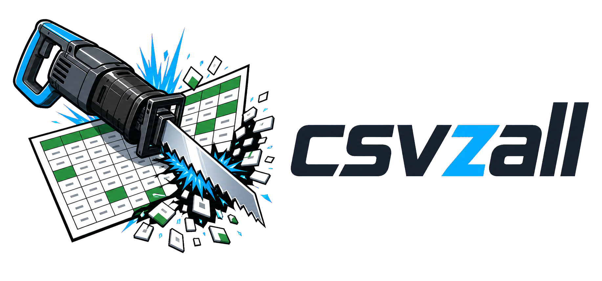

# csvzall



A fast, single-binary CSV transformation CLI for Unix-style pipelines. Pipe CSVs through `filter`, `derive`, `summarize`, and `head` — each command reads stdin, writes stdout, logs to stderr.
For local inspection workflows, `csvzall view <file.csv>` starts a read-only browser table view backed by the same CSV parser.

## Quick example

Compute estimated 1-rep maxes from a [FitNotes](https://www.fitnotesapp.com/) export using the [Epley formula](https://en.wikipedia.org/wiki/One-repetition_maximum#Epley_formula), then show the best set per exercise:

```sh
csvzall filter "Weight > 0 && Reps > 0" FitNotes_Export.csv \
  | csvzall derive "Epley1RM = Weight * (1 + Reps / 30)" - \
  | csvzall summarize --group-by Exercise --max Epley1RM --show Date - \
  | csvzall head -
```

```
+-----------------------+------------+------------------+
| Exercise              | Date       | max_Epley1RM     |
+-----------------------+------------+------------------+
| Overhead Press        | 2025-03-07 | 110.833333333333 |
| Flat Barbell Bench    | 2024-04-20 | 175.666666666667 |
| Deadlift              | 2026-01-18 | 302.5            |
| ...                   | ...        | ...              |
+-----------------------+------------+------------------+
```

## Local API-to-report workflow

Let a host script own API pagination and authentication, then hand deterministic
tabular steps to csvzall:

```sh
# 1. Extract API-shaped JSON into incoming CSV.
csvzall json extract todoist-activities.json --map todoist-map.json > incoming.csv

# 2. Rerunnable keyed import: existing rows win, duplicates are skipped.
csvzall merge activity-store.csv incoming.csv --key event_id --in-place

# 3. Inspect the source table in a browser when Markdown tables get cramped.
csvzall view activity-store.csv

# 4. Produce an Obsidian-ready Markdown summary table.
csvzall sql query --csv activity-store.csv --format markdown --sql \
  "SELECT substr(completed_at, 1, 7) AS month, COUNT(DISTINCT due_date) AS days FROM data GROUP BY month ORDER BY month" \
  > monthly-summary.md

# 5. Render a calendar heatmap SVG.
csvzall heatmap activity-store.csv --date due_date --start 2026-01-01 --end 2026-12-31 \
  --title "Gym Attendance" > gym-heatmap.svg
```

## Commands

### `filter <expression> [input]`

Keep rows where the expression evaluates to non-zero. Supports arithmetic, comparisons (`>`, `<`, `>=`, `<=`, `==`, `!=`), and boolean logic (`&&`/`and`, `||`/`or`).

Column matching is case-insensitive by default. Use `--exact` to require exact case-sensitive column names.

```sh
csvzall filter "Salary > 50000 && Department == 1" employees.csv
csvzall filter --exact "Salary > 50000 && Department == 1" employees.csv
csvzall filter "Score >= 90 || Bonus > 0" -          # read from stdin
```

### `derive <assignment> [input]`

Add a new column computed from an expression. The expression can reference any existing numeric column.

Column matching is case-insensitive by default. Use `--exact` to require exact case-sensitive column names.

```sh
csvzall derive "Tax = Salary * 0.22" employees.csv
csvzall derive --exact "Tax = Salary * 0.22" employees.csv
csvzall derive "BMI = Weight / (Height * Height)" -
```

### `summarize [input]`

Group rows and compute per-group aggregates. The row that produced the winning value is retained, so `--show` columns (e.g. a date or label) come from that row.

```
--group-by <col>     Column to group on (required)
--max <col>          Column to compute the maximum of (required)
--show <col>         Additional columns to carry from the winning row (repeatable)
--exact              Use exact case-sensitive column matching
```

```sh
csvzall summarize --group-by Region --max Revenue --show Quarter sales.csv
csvzall summarize --exact --group-by Region --max Revenue --show Quarter sales.csv
```

Output column is named `max_<col>`.

### `head [input]`

Print the header and first N rows as a formatted ASCII table. Useful for inspecting pipeline output.

```
-n, --rows <N>    Number of data rows to show (default: 50)
```

```sh
csvzall head -n 10 data.csv
some-command | csvzall head -
```

### `json extract <input.json> --map <mapping.json>`

Extract rows from JSON into stable CSV using an explicit mapping file. This is
not a general JSON query command; it supports a small deterministic path subset:
`$`, `.field`, `["field name"]`, `['field name']`, `[0]`, and `[*]`.

```json
{
  "rows": "$.results[*]",
  "columns": {
    "event_id": "$.id",
    "event_type": "$.event_type",
    "completed_at": "$.event_date",
    "content": "$.extra_data.content",
    "due_date": "$.extra_data.due_date",
    "was_overdue": "$.extra_data.was_overdue"
  }
}
```

```sh
csvzall json extract todoist_activities.json --map todoist_activity_map.json > incoming.csv
csvzall merge todoist_activity_store.csv incoming.csv --key event_id --in-place
```

Optional, missing, and null values become empty CSV cells. Nested API payload
paths such as `$.extra_data.content` are evaluated relative to each selected
row. Scalars are emitted as stable text; objects and arrays selected as column
values are rejected.

### `sql query --csv <input.csv> --sql <query>`

Query CSV directly with SQLite SQL. CSV input is loaded into a table named
`data` by default; override it with `--table <name>`. Use `--csv -` to read
CSV from stdin, or `--db <path>` to query an existing SQLite database file.
Query results are streamed as CSV to stdout by default. Pass
`--format markdown` for a deterministic, escaped Markdown table suitable for
Obsidian notes. When loading CSV, csvzall infers SQLite column affinity with
csv-parser: numeric columns stay numeric for comparisons and arithmetic, while
text-like columns and very large integer-looking identifiers are stored as
`TEXT` so row projections preserve exact CSV values.

```sh
csvzall sql query --csv gym-attendance.csv --sql \
  "SELECT substr(date, 1, 7) AS month, COUNT(*) AS attendance_days FROM data GROUP BY month ORDER BY month"

csvzall sql query --csv gym-events.csv --sql \
  "SELECT COUNT(DISTINCT date) AS attendance_days FROM data"

csvzall sql query --csv gym-attendance.csv --format markdown --sql \
  "SELECT substr(date, 1, 7) AS month, COUNT(*) AS attendance_days FROM data GROUP BY month ORDER BY month"
```

SQLite-backed commands support regular expressions through both the `REGEXP`
operator and `regexp_like(value, pattern)`. Prefix a pattern with `(?i)` for
case-insensitive matching.

```sh
csvzall sql query --csv gym-events.csv --sql \
  "SELECT content FROM data WHERE regexp_like(content, '(?i)\b(gym|workout|lift|weights)\b')"
```

### `max [input] --column <name>`

Stream a CSV and print the maximum value in one column without loading SQLite.
Numeric cells compare as numbers through csv-parser's scalar classification;
other scalar text, including ISO timestamp strings, compares deterministically
as text.

```sh
csvzall max todoist_activities.csv --column completed_at
```

### `min [input] --column <name>`

Companion to `max`: stream a CSV and print the minimum value in one column with
the same numeric and deterministic text comparison behavior.

```sh
csvzall min todoist_activities.csv --column completed_at
```

### `view <input.csv> [--no-open]`

Start a local-only read-only HTTP viewer for one plain local CSV file. The
server binds to `127.0.0.1`, prints the full viewer URL to stdout, and opens a
browser by default unless `--no-open` is passed. API requests are gated by a
random session token, and the file path is fixed for the lifetime of the
process. Pass `--startup-json` to print `{"url":"http://127.0.0.1:..."}` for
host integrations such as
[obsidian-csvzall](https://github.com/vincentlaucsb/obsidian-csvzall).

In auto mode, files at or below `--materialize-threshold-mb` (default: 200) are
materialized once so AG Grid can provide client-side sorting, column filters,
and quick filtering for ordinary CSVs. Larger files build a compact row-offset
index and serve rows through paged `/api/rows?offset=...&limit=...` requests
instead of loading the whole table in the browser. AG Grid Community handles
column resizing and virtual scrolling, while the local API (`/api/schema`,
`/api/rows`, `/api/health`) keeps the default experience read-only by design.
Viewer HTML, CSS, JavaScript, and AG Grid assets are embedded in the binary.
The view is a startup-time snapshot of the CSV; reopen the viewer to pick up
on-disk file changes.

For viewer development, pass `--viewer-assets <dir>` or set
`CSVZALL_VIEWER_ASSETS=<dir>` to serve first-party `index.html`, `viewer.css`,
and `viewer.js` from disk on every request. AG Grid and Popright remain
embedded.

Pass `--edit` to enable explicit editable mode. Editable mode materializes the
CSV, allows cell edits plus row/column insert/delete in the browser, tracks
dirty state, supports reset from disk, and saves by writing a temporary sibling
CSV before atomically replacing the source. Save refuses if the source file size
or mtime changed after the viewer opened.

Current limitation: `view` is optimized for plain local CSV files. stdin,
`.gz`, and `.zip` inputs are rejected in this pass. Server-side global
sort/search/filter are deferred for paged mode; the UI only enables full-table
sort/filter when the table is materialized.

```sh
csvzall view todoist_activities.csv
csvzall view todoist_activities.csv --edit
csvzall view todoist_activities.csv --no-open --port 43117
csvzall view todoist_activities.csv --no-open --startup-json
csvzall view todoist_activities.csv --view-mode paged
csvzall view todoist_activities.csv --viewer-assets src/viewer
```

### `calendar [input] --start <YYYY-MM-DD> --end <YYYY-MM-DD>`

Render fixed-shape `date,content` CSV as plain Markdown month tables suitable
for Obsidian notes. The input must contain exact `date` and `content` columns;
`date` must be ISO `YYYY-MM-DD`. Duplicate dates are rejected.

```sh
csvzall calendar habit_days.csv --start 2026-05-01 --end 2026-05-31
csvzall calendar habit_days.csv --start 2026-05-01 --end 2026-06-30 \
  --month-header "{month-name} {year}"
```

Additional columns are ignored. Cells outside the requested range or outside the
current month are left empty, and the `content` value is used as the date cell
body.

### `heatmap [input] --start <YYYY-MM-DD> --end <YYYY-MM-DD>`

Render dated CSV rows as a self-contained SVG calendar heatmap. The input must
contain an ISO `YYYY-MM-DD` date column. If `--value` is omitted, each row
contributes `1`; otherwise the named numeric column is summed per date. Use
`--label` to include cell tooltip text.

```sh
csvzall heatmap gym-attendance.csv --start 2025-05-15 --end 2026-05-15 \
  --date date --title "Gym Attendance" > gym.svg

csvzall heatmap daily-counts.csv --start 2026-01-01 --end 2026-12-31 \
  --date day --value count --label note > heatmap.svg
```

Duplicate dates are aggregated, rows outside the requested range are ignored by
the chart renderer, and the SVG is written to stdout so it can be redirected or
piped like any other csvzall command. The command is built when csvzall is
configured with a local `svgplot` checkout.

### `charts run [id] [--config <path>]`

Run configured generated artifacts from `.csvzall/charts.json`. Existing chart
types render SVG (`heatmap`, `bar`, `line`); `markdown-table` renders an
escaped Markdown table note that can be embedded in Obsidian with
`![[path/to/output]]`. Relative `input` and `output` paths resolve against the
vault or config root, and `runOnSave` lets companion integrations such as
[obsidian-csvzall](https://github.com/vincentlaucsb/obsidian-csvzall)
regenerate the artifact when the source CSV changes.

```json
{
  "charts": [
    {
      "id": "monthly-summary",
      "type": "markdown-table",
      "input": "activity-store.csv",
      "output": "Reports/generated/monthly-summary.md",
      "runOnSave": true,
      "options": {
        "sql": "SELECT substr(completed_at, 1, 7) AS month, COUNT(*) AS days FROM data GROUP BY month ORDER BY month"
      }
    },
    {
      "id": "recent-events",
      "type": "markdown-table",
      "input": "activity-store.csv",
      "output": "Reports/generated/recent-events.md",
      "options": {
        "columns": ["completed_at", "content", "due_date"]
      }
    }
  ]
}
```

If neither `sql` nor `columns` is provided, `markdown-table` exports all CSV
columns. Pass `--validate` to check selected configs without writing output.

### `append <existing.csv> <incoming.csv> [--in-place]`

Append one CSV to another after validating that headers match exactly. Without
`--in-place`, the combined CSV is written to stdout. With `--in-place`, csvzall
writes a temporary sibling file and replaces the original only after validation
and output writing succeed. `append` does not inspect keys or deduplicate rows;
use `merge` for rerunnable keyed imports.

```sh
csvzall append existing.csv incoming.csv > combined.csv
csvzall append existing.csv incoming.csv --in-place
```

### `merge <existing.csv> <incoming.csv> --key <column> [--in-place]`

Merge incoming rows into an existing CSV for rerunnable local imports. Headers
must match exactly. The key column must exist in both files. Duplicate keys
within existing fail, duplicate keys within incoming fail, and incoming rows
whose key already exists are skipped so existing rows win.

Without `--in-place`, the merged CSV is written to stdout. With `--in-place`,
csvzall writes a temporary sibling file and replaces the original only after
validation and output writing succeed. Added/skipped counts are reported on
stderr unless `--quiet` is set.

```sh
csvzall merge activity-store.csv incoming.csv --key event_id > merged.csv
csvzall merge activity-store.csv incoming.csv --key event_id --in-place
```

### `infer [input]`

Infer the PostgreSQL schema that `postgres` export would use, without connecting to a database or loading rows. This is useful for inspecting type inference and timing inference separately from `COPY`.

```sh
csvzall infer vehicles.csv --table used_cars --verbose
```

### `postgres [input]`

Export CSV rows into PostgreSQL with full-file schema inference followed by `COPY`.

```sh
csvzall postgres vehicles.csv --dbname postgres --user postgres --table used_cars
```

Files ending in `.gz` are read as gzip-compressed CSV automatically:

```sh
csvzall head vehicles.csv.gz
csvzall postgres vehicles.csv.gz --dbname postgres --user postgres --table used_cars
```

Files ending in `.zip` are read as ZIP-compressed CSV automatically when the
archive contains exactly one file. For archives with multiple files, pass
`--zip-entry <name>` to select the CSV member:

```sh
csvzall head vehicles.zip
csvzall head archive.zip --zip-entry exports/vehicles.csv
```

Credential storage is optional. Save a PostgreSQL password to the OS keychain:

```sh
csvzall postgres --save --host localhost --port 5432 --dbname postgres --user postgres
```

Normal `postgres` runs try the keychain first, then prompt with masked input if
no credential is found. `--password` remains available for automation but prints
a warning because command-line passwords are visible in shell history and process
lists. `--password-env VARNAME` reads the password from an environment variable.

Remove stored PostgreSQL credentials:

```sh
csvzall forget postgres
csvzall forget postgres --host localhost --port 5432 --dbname postgres --user postgres
```

`--copy-batch-rows <N>` tunes the producer batch size for the COPY pipeline. The default is `10000`, which keeps memory bounded well on large files; larger values may increase peak memory without improving throughput.

`--parallel-copy [N]` runs multiple PostgreSQL COPY workers, each with its own
connection. This can improve throughput when a single COPY stream is the
bottleneck, but physical insertion order is not preserved. The default is `1`
when the flag is omitted. Passing `--parallel-copy` without a value uses
`min(hardware_concurrency / 2, 8)`, and explicit values are capped at hardware
concurrency.

## Pipelines are shell scripts

There is no built-in pipeline format. Save complex chains as PowerShell, Bash, or batch scripts — they're already shareable, version-controllable, and composable with the rest of your toolbox.

## Building

Requires CMake 3.25+ and a C++23 compiler. A local [csv-parser](https://github.com/vincentlaucsb/csv-parser) checkout is preferred for development, the in-repo submodule is used for CI/release builds, and CMake can fetch a pinned fallback when no local checkout or submodule is configured.

```sh
# csv-parser can live at ../csv-parser, external/csv-parser, or a custom path.
# When both local paths exist, ../csv-parser is preferred by default.
cmake -S . -B build
cmake --build build --config Release
```

To specify a custom csv-parser location:

```sh
cmake -S . -B build -DCSV_PARSER_ROOT=/path/to/csv-parser
```

To enable SVG chart output, install `svgplot`, keep it as a sibling checkout, let
CMake fetch it from GitHub, or pass its location explicitly:

```sh
cmake -S . -B build -DSVGPLOT_ROOT=/path/to/svgplot
```

The binary is at `build/Release/csvzall.exe` (Windows) or `build/csvzall` (Linux/macOS).

### Windows install helper

Windows users can build, install, and add `csvzall` to PATH with:

```powershell
.\scripts\Install-csvzall.ps1
```

By default this installs to `C:\Program Files\csvzall`, adds
`C:\Program Files\csvzall\bin` to the machine PATH, and relaunches with a
Windows UAC prompt if Administrator rights are required. The installer refuses
to install a build without SVG chart support because `csvzall view` and
companion integration chart workflows rely on the `charts` command.

For a per-user install that does not require elevation:

```powershell
.\scripts\Install-csvzall.ps1 -InstallPrefix "$env:LOCALAPPDATA\csvzall" -PathScope User
```

For intentionally minimal installs without chart rendering, pass `-AllowNoSvg`.

## Dependencies

| Library | Author / maintainer | Role | How it's sourced |
|---|---|---|---|
| [csv-parser](https://github.com/vincentlaucsb/csv-parser) | [Vincent La](https://github.com/vincentlaucsb) | CSV parsing, writing, and scalar type classification | Local checkout preferred; in-repo submodule for CI/release builds; pinned FetchContent fallback |
| [simdjson](https://github.com/simdjson/simdjson) v3.13.0 | [Daniel Lemire](https://github.com/lemire), [Geoff Langdale](https://github.com/geofflangdale), and contributors | JSON parsing for mapping-driven `json extract` | System package if available; FetchContent fallback |
| [JSON for Modern C++](https://github.com/nlohmann/json) v3.12.0 | [Niels Lohmann](https://github.com/nlohmann) and contributors | JSON serialization and configuration helpers | System package if available; FetchContent fallback |
| [svgplot](https://github.com/vincentlaucsb/svgplot) v0.4.0 | [Vincent La](https://github.com/vincentlaucsb) | SVG chart rendering for `heatmap`, `bar`, and `line` chart outputs | CMake package if available; local checkout via `SVGPLOT_ROOT` or sibling `../svgplot`; pinned FetchContent fallback |
| [argparse](https://github.com/p-ranav/argparse) v3.1 | [Pranav](https://github.com/p-ranav) | CLI argument parsing | FetchContent |
| [cpp-httplib](https://github.com/yhirose/cpp-httplib) v0.18.5 | [Yuji Hirose](https://github.com/yhirose) and contributors | Embedded local HTTP server for the `view` command | Vendored single header under `vendor/httplib` |
| [indicators](https://github.com/p-ranav/indicators) v2.3 | [Pranav](https://github.com/p-ranav) | Terminal progress bars for long-running imports | FetchContent |
| [AG Grid Community](https://www.ag-grid.com/javascript-data-grid/getting-started/) v32.3.9 | [AG Grid Ltd.](https://www.ag-grid.com/) | Interactive browser table for the `view` command | Vendored browser assets under `vendor/ag-grid`, embedded into csvzall at build time |
| [Popright](https://github.com/vincentlaucsb/popright) v0.0.1 | [Vincent Lau](https://github.com/vincentlaucsb) | Context menu primitive for the `view` command | Vendored npm package under `vendor/popright`, embedded into csvzall at build time |
| [zlib](https://github.com/madler/zlib) v1.3.1 | [Mark Adler](https://github.com/madler) and contributors | gzip and ZIP/deflate decompression for compressed CSV inputs | System package if available; FetchContent fallback |
| [keychain](https://github.com/hrantzsch/keychain) v1.3.1 | [hrantzsch](https://github.com/hrantzsch) | Optional OS credential storage for PostgreSQL passwords | System package if available; FetchContent fallback; Linux requires libsecret |
| [SQLiteCpp](https://github.com/SRombauts/SQLiteCpp) v3.3.2 | [Sébastien Rombauts](https://github.com/SRombauts) | SQLite C++ wrapper using bundled SQLite | FetchContent, with a local CMake patch |
| [libpqxx](https://github.com/jtv/libpqxx) v7.10.1 | [Jeroen T. Vermeulen](https://pqxx.org/libpqxx/) | PostgreSQL C++ client API used by the `postgres` command | System package if available; FetchContent fallback |
| [PostgreSQL libpq](https://www.postgresql.org/docs/current/libpq.html) | [PostgreSQL Global Development Group](https://www.postgresql.org/community/) | PostgreSQL client C library required by libpqxx | System PostgreSQL installation |
| [Catch2](https://github.com/catchorg/Catch2) v3.4.0 | [Catch2 contributors](https://github.com/catchorg/Catch2) | Test framework | FetchContent, tests only |
| [gcovr](https://github.com/gcovr/gcovr) | [gcovr contributors](https://github.com/gcovr/gcovr/graphs/contributors) | Coverage report generation for CI | GitHub Actions coverage workflow only |
| [Codecov GitHub Action](https://github.com/codecov/codecov-action) v5 | [Codecov](https://about.codecov.io/) | Upload coverage reports to Codecov | GitHub Actions coverage workflow only |

## Design notes

- Data flows on **stdout**, diagnostics on **stderr**. Every command is safe to pipe.
- `-` as the input path means stdin. All commands accept it.
- `filter` and `derive` use SQL syntax — standard `WHERE` clauses and SQL expressions.
- SQLite-backed commands support `REGEXP` and `regexp_like(value, pattern)`;
  NULL input does not match and invalid patterns fail the query.
- `merge` is the keyed rerunnable import primitive; `append` is only exact-header concatenation.
- Column matching is case-insensitive by default (SQLite identifier resolution).
- `calendar` consumes fixed-shape `date,content` CSV, rejects duplicate dates, and renders locale-independent Sunday-first month tables.
- `heatmap` consumes generic dated CSV, aggregates duplicate dates, and renders a self-contained SVG through svgplot when that library is configured.

## License

csvzall is licensed under the MIT License. See [LICENSE](LICENSE).

## Roadmap

- [x] Case-insensitive column matching by default (`filter`, `derive`, `summarize`)
- [ ] Test suite (Google Test / Catch2 via CTest)
- [ ] Throughput stats on `--verbose` (rows/s, MiB/s)
- [ ] Richer `summarize` aggregations: `--min`, `--mean`, `--sum`, `--count`
- [ ] Optional JSON mapping discovery helper, e.g. `json paths <input.json> --rows <path>`
